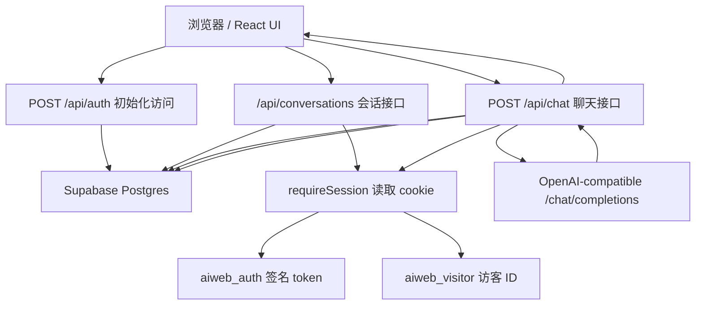

# AI 问答网站项目说明与面试准备

这份文档用于帮助你从“会使用项目”升级到“能讲清楚项目”。它覆盖项目目标、架构、核心流程、数据库设计、关键代码、运行部署、测试策略，以及面试中容易被追问的问题。

## 1. 项目一句话介绍

这是一个基于 Next.js 的公开 AI 问答网站。用户打开网页后不需要输入访问密码，系统会自动为当前浏览器初始化一个访客身份，然后用户可以创建会话、发送问题、接收 AI 回复，并把对话历史保存到 Supabase Postgres。

当前版本的核心特点：

- 公开访问：不再需要访问密码。
- 无每日额度限制：不再调用 `usage_logs` 或 `increment_usage_if_allowed`。
- 浏览器级历史隔离：不同浏览器通过 `visitor_id` cookie 区分各自会话。
- 服务端保密：AI Key、Supabase service role key 只在服务端读取。
- OpenAI-compatible AI 调用：后端调用 `/chat/completions`，非流式返回。
- 豆包风格 UI：浅色背景、蓝色主按钮、左侧会话栏、底部输入框。

## 2. 技术栈

| 层级 | 技术 | 用途 |
| --- | --- | --- |
| 前端框架 | Next.js 16 App Router | 页面、布局、API 路由统一在一个项目中 |
| UI | React 19 + Tailwind CSS 4 | 组件化界面和响应式样式 |
| 后端接口 | Next.js Route Handlers | `/api/auth`、`/api/chat`、会话接口 |
| 数据库 | Supabase Postgres | 保存访问身份、会话、消息 |
| Supabase SDK | `@supabase/supabase-js` | 服务端访问数据库 |
| AI 接口 | OpenAI-compatible Chat Completions | 调用模型生成回答 |
| 单元测试 | Vitest + Testing Library | 测试组件、工具函数、API 路由逻辑 |
| E2E 测试 | Playwright | 模拟用户打开网页和操作聊天 UI |
| 代码质量 | ESLint + Next core web vitals | 静态检查和 React 规则检查 |

## 3. 目录结构

```text
D:\creat\aiweb
├─ src
│  ├─ app
│  │  ├─ page.tsx                         # 首页，直接渲染 ChatApp
│  │  ├─ layout.tsx                       # HTML 骨架和 metadata
│  │  ├─ globals.css                      # Tailwind 入口和全局字体/颜色
│  │  └─ api
│  │     ├─ auth/route.ts                 # 初始化公开访问 cookie
│  │     ├─ chat/route.ts                 # 处理用户提问和 AI 回复
│  │     └─ conversations
│  │        ├─ route.ts                   # 获取/创建会话
│  │        ├─ [id]/route.ts              # 删除会话
│  │        └─ [id]/messages/route.ts     # 获取指定会话消息
│  ├─ components
│  │  ├─ ChatApp.tsx                      # 聊天主容器和状态管理
│  │  ├─ ConversationList.tsx             # 左侧会话列表
│  │  ├─ MessageList.tsx                  # 消息展示区
│  │  └─ Composer.tsx                     # 底部输入框
│  └─ lib
│     ├─ ai.ts                            # AI 接口调用封装
│     ├─ auth.ts                          # cookie token 签名和验证
│     ├─ client-api.ts                    # 浏览器 fetch JSON 封装
│     ├─ env.ts                           # 环境变量读取和校验
│     ├─ limits.ts                        # 用户输入长度校验
│     ├─ session.ts                       # 服务端读取会话 cookie
│     ├─ supabase.ts                      # Supabase service-role 客户端
│     └─ types.ts                         # 前后端共享类型
├─ supabase/schema.sql                    # 数据库表和旧版额度函数
├─ scripts/hash-access-code.mjs           # 生成 access_keys 插入 SQL 的辅助脚本
├─ tests/unit                             # 单元测试
└─ tests/e2e                              # Playwright 端到端测试
```

## 4. 总体架构



核心思路：

1. 浏览器打开首页，渲染 `ChatApp`。
2. `ChatApp` 挂载后先调用 `/api/auth`，让后端设置身份 cookie。
3. 后端从 Supabase 的 `access_keys` 表取第一条 enabled 记录，作为内部归属身份。
4. 后端生成 `aiweb_auth` 和 `aiweb_visitor` 两个 httpOnly cookie。
5. 前端随后加载当前浏览器的会话列表。
6. 用户发送消息时，后端根据 cookie 确认当前浏览器身份，保存消息并调用 AI。

## 5. 关键用户流程

### 5.1 首次打开网页

涉及文件：

- `src/app/page.tsx`
- `src/components/ChatApp.tsx`
- `src/app/api/auth/route.ts`
- `src/lib/auth.ts`
- `src/lib/session.ts`

流程：

```text
用户打开 /
  -> page.tsx 渲染 ChatApp
  -> ChatApp useEffect 调用 POST /api/auth
  -> /api/auth 查询 access_keys 第一条 enabled 记录
  -> 生成 visitorId
  -> 用 APP_ACCESS_SECRET 签名 accessKeyId
  -> 设置 aiweb_auth 和 aiweb_visitor cookie
  -> ChatApp 调用 GET /api/conversations
  -> 页面显示历史会话或空状态
```

为什么还需要 `access_keys`：

当前版本不再把它当作“访问密码表”，但数据库结构里 `conversations.access_key_id` 是必填外键，所以仍然需要一条 enabled `access_keys` 记录作为“公开访问身份”。这样可以最小改动保留原有数据模型，以后也方便恢复密码或做多入口身份。

### 5.2 新建会话

涉及文件：

- `src/components/ConversationList.tsx`
- `src/components/ChatApp.tsx`
- `src/app/api/conversations/route.ts`

流程：

```text
点击 新建对话
  -> ChatApp.createConversation()
  -> POST /api/conversations
  -> requireSession 校验 cookie
  -> 插入 conversations
  -> 前端把新会话插入左侧列表
  -> activeId 指向新会话
```

如果没有手动新建会话，用户第一次发送消息时，`/api/chat` 也会自动创建会话。

### 5.3 发送消息

涉及文件：

- `src/components/Composer.tsx`
- `src/components/ChatApp.tsx`
- `src/app/api/chat/route.ts`
- `src/lib/ai.ts`
- `src/lib/limits.ts`

流程：

```text
用户输入问题并点击发送
  -> Composer 调用 onSend(message)
  -> ChatApp 先乐观插入用户消息
  -> POST /api/chat
  -> requireSession 获取 accessKeyId + visitorId
  -> validateUserMessage 校验空字符串和长度
  -> ensureConversation 确认或创建会话
  -> 读取最近 12 条历史消息
  -> callChatCompletion 调用 AI 服务
  -> 插入用户消息和 AI 回复到 messages
  -> 更新 conversations.updated_at
  -> 返回 AI 回复
  -> 前端显示助手气泡并刷新会话列表
```

为什么只取最近 12 条历史：

- 控制发送给模型的上下文长度，避免 token 成本失控。
- 保留短期上下文，足够支持连续追问。
- 实现简单，适合当前轻量项目。

### 5.4 读取历史消息

涉及文件：

- `src/components/ConversationList.tsx`
- `src/components/ChatApp.tsx`
- `src/app/api/conversations/[id]/messages/route.ts`

流程：

```text
点击左侧某个会话
  -> GET /api/conversations/:id/messages
  -> 后端先检查这个会话是否属于当前 accessKeyId + visitorId
  -> 查询 messages 并按 created_at 升序返回
  -> 前端渲染消息气泡
```

这里的所有权检查很重要：即使用户知道某个 conversation id，也不能读取不属于当前浏览器访客的会话。

### 5.5 删除会话

涉及文件：

- `src/components/ConversationList.tsx`
- `src/app/api/conversations/[id]/route.ts`

流程：

```text
点击会话旁边的删除按钮
  -> DELETE /api/conversations/:id
  -> 后端按 id + accessKeyId + visitorId 删除
  -> conversations 删除后，messages 通过 on delete cascade 自动删除
```

## 6. 前端组件解释

### 6.1 `ChatApp.tsx`

职责：

- 管理全局聊天状态。
- 初始化公开访问。
- 加载会话列表。
- 处理会话选择、新建、删除。
- 处理发送消息和错误提示。

核心 state：

```ts
const [conversations, setConversations] = useState<ConversationSummary[]>([]);
const [activeId, setActiveId] = useState<string | null>(null);
const [messages, setMessages] = useState<ChatMessage[]>([]);
const [loading, setLoading] = useState(false);
const [error, setError] = useState("");
```

面试讲法：

> `ChatApp` 是前端状态中心，但它不直接处理数据库或 AI，只通过 `apiJson` 调用后端接口。这样浏览器不会接触任何密钥，状态和副作用也集中在一个入口组件里。

### 6.2 `ConversationList.tsx`

职责：

- 展示左侧会话列表。
- 高亮当前会话。
- 触发新建、选择、删除会话。

它是展示型组件，业务逻辑通过 props 传入：

```ts
onSelect: (id: string) => void;
onCreate: () => void;
onDelete: (id: string) => void;
```

### 6.3 `MessageList.tsx`

职责：

- 空状态显示“今天想聊点什么？”。
- 按 `role` 区分用户气泡和助手气泡。
- `loading` 时显示“正在思考”的动效。

### 6.4 `Composer.tsx`

职责：

- 管理输入框本地值。
- 阻止空消息提交。
- 提交后清空输入框。
- 调用父组件传入的 `onSend`。

## 7. 后端接口解释

### 7.1 `POST /api/auth`

文件：`src/app/api/auth/route.ts`

现在它不是密码登录接口，而是“公开访问初始化接口”。

它做三件事：

1. 从 `access_keys` 取第一条 enabled 记录。
2. 生成或复用当前浏览器的 visitorId。
3. 写入两个 cookie。

两个 cookie：

| Cookie | 用途 | 是否 httpOnly |
| --- | --- | --- |
| `aiweb_auth` | 保存签名后的 `{ accessKeyId }` | 是 |
| `aiweb_visitor` | 保存当前浏览器访客 ID | 是 |

为什么用 httpOnly：

- JS 无法直接读取 cookie，减少 XSS 后窃取身份的风险。
- 后端 Route Handler 可以通过 `next/headers` 的 `cookies()` 读取。

### 7.2 `GET /api/conversations`

返回当前浏览器访客的会话列表。

查询条件：

```ts
.eq("access_key_id", session.accessKeyId)
.eq("visitor_id", session.visitorId)
```

这两个字段共同决定“谁能看到哪些会话”。

### 7.3 `POST /api/conversations`

创建一个空会话。默认标题为 `新会话`，也支持传入自定义标题，最多 80 个字符。

### 7.4 `DELETE /api/conversations/[id]`

删除指定会话，并且只允许删除属于当前访客的会话。

删除 conversations 后，数据库中 messages 有 `on delete cascade`，所以该会话消息会自动删除。

### 7.5 `GET /api/conversations/[id]/messages`

读取指定会话的消息。后端先检查会话归属，再读取消息，避免越权访问。

### 7.6 `POST /api/chat`

这是最核心的接口。

它负责：

- 校验会话 cookie。
- 校验用户输入。
- 确保 conversation 存在。
- 查询最近上下文。
- 调用 AI。
- 保存 user 和 assistant 两条消息。
- 返回助手回答。

当前版本已经取消：

- 访问密码校验。
- 每日使用额度检查。
- `usage_logs` 写入。
- `increment_usage_if_allowed` RPC 调用。

## 8. 数据库设计

文件：`supabase/schema.sql`

### 8.1 `access_keys`

```sql
create table if not exists access_keys (
  id uuid primary key default gen_random_uuid(),
  label text not null,
  key_hash text unique not null,
  enabled boolean not null default true,
  daily_limit integer not null default 100,
  created_at timestamptz not null default now()
);
```

历史用途：保存访问密码哈希和每日额度。

当前用途：保存一条 enabled 记录，作为公开访问的内部身份归属。`key_hash` 和 `daily_limit` 现在不参与运行逻辑。

面试中如果被问“为什么还留着”：

> 因为 conversations 表依赖 access_keys 外键。为了最小化数据库迁移风险，我先保留 access_keys 作为公开访问身份表。后续如果要彻底简化，可以做一次数据库迁移，把 conversations.access_key_id 改成 nullable 或移除，再删除 access_keys 和 usage_logs。

### 8.2 `conversations`

保存每个访客的会话。

关键字段：

- `access_key_id`：内部访问身份。
- `visitor_id`：浏览器访客 ID。
- `title`：会话标题。
- `updated_at`：用于列表排序。

索引：

```sql
create index if not exists conversations_owner_idx
  on conversations (access_key_id, visitor_id, updated_at desc);
```

这个索引服务于会话列表查询：按身份和访客筛选，再按更新时间倒序。

### 8.3 `messages`

保存消息内容。

关键字段：

- `conversation_id`：所属会话。
- `role`：`user` 或 `assistant`。
- `content`：消息正文。
- `created_at`：消息顺序。

约束：

```sql
role text not null check (role in ('user', 'assistant'))
```

这样可以避免写入非法角色。

### 8.4 `usage_logs`

历史用途：记录每日使用次数。

当前版本不再使用它。保留它不影响运行，也方便以后恢复限额能力。

### 8.5 `increment_usage_if_allowed`

历史用途：原子检查并递增每日额度。

当前版本 `/api/chat` 不再调用这个函数。

## 9. 环境变量

文件：`.env.example`

| 变量 | 用途 | 是否敏感 | 当前是否必需 |
| --- | --- | --- | --- |
| `AI_BASE_URL` | OpenAI-compatible API 地址 | 否 | 是 |
| `AI_API_KEY` | AI 服务密钥 | 是 | 是 |
| `AI_MODEL` | 模型名称 | 否 | 是 |
| `SUPABASE_URL` | Supabase 项目 URL | 否 | 是 |
| `SUPABASE_SERVICE_ROLE_KEY` | Supabase 后端高权限密钥 | 是 | 是 |
| `APP_ACCESS_SECRET` | cookie token HMAC 签名密钥 | 是 | 是 |

重要原则：

- `SUPABASE_SERVICE_ROLE_KEY` 只能在服务端使用，不能加 `NEXT_PUBLIC_`。
- `AI_API_KEY` 只能在服务端使用。
- `APP_ACCESS_SECRET` 用于签名 cookie，泄露后需要更换。

## 10. 安全模型

### 10.1 前端不接触密钥

浏览器只请求本项目自己的 `/api/*` 接口，不直接请求 Supabase 或 AI 服务。因此：

- AI Key 不会出现在浏览器网络请求里。
- Supabase service role key 不会暴露给用户。

### 10.2 使用签名 cookie

`src/lib/auth.ts` 用 HMAC-SHA256 签名 payload：

```text
payload = base64url(JSON.stringify({ accessKeyId }))
signature = HMAC_SHA256(payload, APP_ACCESS_SECRET)
token = payload.signature
```

验证时用 `timingSafeEqual` 比较签名，避免简单时间侧信道。

### 10.3 访客隔离

所有会话查询都包含：

```ts
access_key_id = session.accessKeyId
visitor_id = session.visitorId
```

这意味着同一个公开入口下，不同浏览器看到的是自己的历史记录。

### 10.4 公开访问的风险

取消密码和额度限制后，任何能访问网站的人都可以调用 AI。这会带来：

- AI API 成本风险。
- 恶意刷请求风险。
- 数据库增长风险。

如果面试官问“你怎么控制成本”，可以回答：

> 当前需求是公开访问且取消额度，所以代码移除了限额逻辑。但我保留了原数据库中的 `usage_logs` 和 RPC 函数，后续可以很容易恢复每日限额，或者在 `/api/chat` 前增加 IP 限流、验证码、Cloudflare Turnstile、Vercel/Edge rate limiting 等保护。

## 11. AI 调用原理

文件：`src/lib/ai.ts`

请求格式：

```http
POST {AI_BASE_URL}/chat/completions
Authorization: Bearer {AI_API_KEY}
Content-Type: application/json
```

请求体：

```json
{
  "model": "gpt-5.5",
  "messages": [
    { "role": "user", "content": "hello" }
  ],
  "stream": false
}
```

实现细节：

- `AI_BASE_URL.replace(/\/$/, "")` 去掉末尾 `/`，避免拼接出双斜杠。
- `AbortController` 设置 30 秒超时。
- 非 2xx 响应统一转成友好的错误。
- 如果 `choices[0].message.content` 为空，也转成友好错误。

为什么不用流式：

- 实现更简单，前端只等一个完整回答。
- 数据库保存逻辑更直接，不需要边流式边拼接。
- 对初版项目足够稳定。

如果要改成流式：

- 后端需要返回 `ReadableStream`。
- 前端需要逐步读取 chunks。
- 数据库保存要在流完成后写入最终文本，或者引入中间状态。

## 12. 测试策略

### 12.1 单元测试

运行：

```powershell
npm run test
```

覆盖内容：

- `tests/unit/ai.test.ts`：AI 请求格式和错误处理。
- `tests/unit/auth.test.ts`：cookie token 签名和篡改检测。
- `tests/unit/limits.test.ts`：消息为空和超长校验。
- `tests/unit/ChatApp.test.tsx`：页面打开后先初始化公开访问，再加载会话。
- `tests/unit/chat-route.test.ts`：聊天接口不再查询 `access_keys` 或 `usage_logs` 做额度检查。

### 12.2 E2E 测试

运行：

```powershell
npm run test:e2e
```

`tests/e2e/chat.spec.ts` 会模拟：

- 打开首页。
- 自动调用 `/api/auth`。
- 展示聊天空状态。
- 新建会话。

### 12.3 Lint 和构建

```powershell
npm run lint
npm run build
```

`npm run build` 会同时检查 Next.js 编译、TypeScript 和页面生成。

## 13. 本地运行

### 13.1 安装依赖

```powershell
npm install
```

### 13.2 配置环境变量

复制 `.env.example` 到 `.env.local`，填入：

```env
AI_BASE_URL=https://api.shareai.codes/v1
AI_API_KEY=你的 AI Key
AI_MODEL=gpt-5.5
SUPABASE_URL=https://你的项目.supabase.co
SUPABASE_SERVICE_ROLE_KEY=你的 service_role 或 sb_secret
APP_ACCESS_SECRET=一段足够随机的字符串
```

### 13.3 初始化 Supabase

在 Supabase SQL Editor 运行：

```text
supabase/schema.sql
```

然后确保 `access_keys` 至少有一条 enabled 记录。可以继续使用现有脚本生成插入 SQL：

```powershell
$env:APP_ACCESS_SECRET="你的 APP_ACCESS_SECRET"
npm run access-code -- public 任意字符串
```

输出的 SQL 放到 Supabase SQL Editor 运行即可。

注意：当前版本不再校验用户输入的密码，所以这个“任意字符串”只是为了生成一条满足旧表结构的 `access_keys` 记录。

### 13.4 启动本地开发服务器

```powershell
npm run dev
```

访问：

```text
http://127.0.0.1:3000
```

## 14. 部署说明

推荐部署到 Vercel。

部署时需要在 Vercel 项目环境变量里配置：

```text
AI_BASE_URL
AI_API_KEY
AI_MODEL
SUPABASE_URL
SUPABASE_SERVICE_ROLE_KEY
APP_ACCESS_SECRET
```

部署前检查：

```powershell
npm run test
npm run lint
npm run build
```

## 15. 面试高频问答

### Q1：这个项目解决了什么问题？

它提供了一个轻量 AI 问答网站，用户打开即可提问，系统会保存不同浏览器的会话历史。项目重点是把前端体验、服务端密钥保护、数据库持久化和 AI 调用串起来。

### Q2：为什么用 Next.js？

Next.js 同时提供 React 前端和服务端 Route Handlers，适合这种“小型全栈 AI 应用”。前端页面、后端 API、环境变量读取、构建部署都在一个项目里，复杂度低。

### Q3：为什么 AI 调用必须放服务端？

因为 AI API Key 是敏感信息。如果前端直接请求 AI 服务，Key 会暴露在浏览器网络请求中。现在由 `/api/chat` 在服务端读取 `AI_API_KEY` 并转发请求，浏览器只能拿到最终回答。

### Q4：为什么 Supabase 使用 service role key？

后端需要直接读写 `access_keys`、`conversations`、`messages`。service role key 权限高，适合放在可信服务端使用。它不能暴露给浏览器。

### Q5：取消密码后，为什么还要 `/api/auth`？

它现在不负责校验密码，而是负责初始化浏览器身份。它会设置 httpOnly cookie，让后续会话和消息接口知道“这是哪个浏览器访客”。

### Q6：`access_keys` 现在还有什么用？

它从“密码表”退化成“公开访问身份表”。因为 `conversations.access_key_id` 仍然是必填外键，所以保留一条 enabled 记录作为内部归属，避免做数据库破坏性迁移。

### Q7：怎么区分不同用户？

通过 `aiweb_visitor` cookie。每个浏览器首次访问会生成一个 UUID，后续所有会话都按 `visitor_id` 隔离。

### Q8：如果用户清空浏览器 cookie 会怎样？

他会获得新的 `visitor_id`，旧会话仍在数据库里，但当前浏览器不再能通过正常接口看到旧历史。

### Q9：聊天上下文怎么传给 AI？

`/api/chat` 读取当前会话最近 12 条消息，按时间恢复顺序，然后追加本次用户问题，传给 OpenAI-compatible `/chat/completions`。

### Q10：为什么保存消息是在 AI 返回之后？

当前实现简单：AI 成功后一次性插入用户消息和助手消息。这样避免 AI 失败时数据库里出现只有用户消息、没有助手回答的半完成记录。

### Q11：如果 AI 服务失败会怎样？

`callChatCompletion` 会抛出友好错误，前端会撤回乐观插入的用户消息，并展示错误提示。

### Q12：什么是乐观 UI？

用户点击发送后，前端先把用户消息显示出来，不等后端完成。这样体验更快。如果后端失败，再把这条临时消息移除。

### Q13：为什么不做流式输出？

当前版本追求稳定和简单。非流式回答更容易保存数据库、测试和处理错误。流式适合后续体验升级。

### Q14：取消额度限制有什么风险？

主要是成本和滥用风险。任何访问者都能消耗 AI API 额度。当前是按用户需求取消，但后续建议补充 IP 限流、验证码或恢复 `usage_logs`。

### Q15：如果要恢复每日额度，怎么做？

可以在 `/api/chat` 里恢复：

1. 查询当前 access key 的 `daily_limit`。
2. 调用 `increment_usage_if_allowed`。
3. 如果返回不允许，就返回 429。
4. 如果允许，再继续 AI 调用。

数据库函数和 `usage_logs` 表目前仍保留。

### Q16：为什么删除会话会自动删除消息？

`messages.conversation_id` 定义了 `references conversations(id) on delete cascade`。这表示会话删除时，数据库自动删除该会话下的消息，避免孤儿数据。

### Q17：这个项目有哪些测试？

有单元测试和 E2E 测试。单元测试覆盖 AI 调用、token 签名、输入校验、公开初始化和取消限额。E2E 测试覆盖用户打开页面、新建会话的主流程。

### Q18：如何保证用户不能看别人的会话？

所有读写会话和消息的接口都用 `access_key_id + visitor_id` 作为查询条件。即使用户猜到 conversation id，也必须匹配当前 cookie 中的 visitor id。

### Q19：项目最大短板是什么？

当前公开访问没有限流，存在成本风险。另外，`access_keys` 和 `usage_logs` 保留了历史结构，数据模型还可以在后续迁移中进一步简化。

### Q20：如果让你继续优化，你会做什么？

优先级建议：

1. 增加限流或验证码，保护 AI 成本。
2. 支持流式输出，提升聊天体验。
3. 增加会话标题自动总结。
4. 增加清空历史、重命名会话功能。
5. 做一次数据库迁移，简化公开访问模式下的旧字段。

## 16. 常见故障排查

### 页面提示“访问尚未初始化”

可能原因：

- `/api/auth` 没有成功设置 cookie。
- Supabase 的 `access_keys` 没有 enabled 记录。
- `APP_ACCESS_SECRET` 缺失或变更导致旧 cookie 验证失败。

处理：

1. 确认 `.env.local` 有 `APP_ACCESS_SECRET`。
2. 确认 Supabase `access_keys` 至少有一条 `enabled = true`。
3. 清空浏览器 cookie 后刷新。

### AI 一直失败

检查：

- `AI_BASE_URL` 是否正确。
- `AI_API_KEY` 是否有效。
- `AI_MODEL` 是否是服务商支持的模型。
- 后端日志是否出现 401、429、500。

### Supabase 报错

检查：

- `SUPABASE_URL` 是否是项目 URL。
- `SUPABASE_SERVICE_ROLE_KEY` 是否是 secret/service_role，不是 publishable key。
- 是否已经运行 `supabase/schema.sql`。

### 测试跑不起来

单元测试：

```powershell
npm run test
```

E2E 测试需要本机 Chrome，配置在 `playwright.config.ts`：

```ts
executablePath: "C:\\Program Files\\Google\\Chrome\\Application\\chrome.exe"
```

如果机器上 Chrome 路径不同，需要修改这里。

## 17. 面试讲解模板

你可以按这个顺序讲项目：

1. 我做的是一个公开访问的 AI 问答网站。
2. 前端使用 Next.js + React，UI 是豆包风格聊天界面。
3. 后端使用 Next.js Route Handlers，所有 AI 和 Supabase 密钥都只在服务端使用。
4. 用户打开页面后，前端自动调用 `/api/auth` 初始化浏览器身份。
5. 后端用 HMAC 签名 cookie 保存访问身份，用 UUID visitorId 区分不同浏览器。
6. 会话和消息保存到 Supabase Postgres，查询时用 accessKeyId + visitorId 隔离数据。
7. 用户发送问题后，后端读取最近 12 条上下文，调用 OpenAI-compatible chat completions。
8. AI 返回后，后端把用户消息和助手回复写入数据库，再返回给前端。
9. 我用 Vitest 覆盖核心逻辑，用 Playwright 覆盖公开访问和新建会话流程。
10. 当前按需求取消了密码和额度限制，但保留了旧表结构，后续可以低成本恢复限流或做数据库迁移。

## 18. 当前改动状态备注

当前代码已经朝“公开访问、无额度限制”调整：

- 删除了 `PasswordGate` 组件和相关测试。
- 首页直接渲染 `ChatApp`。
- `ChatApp` 自动调用 `/api/auth` 初始化访问。
- `/api/chat` 不再调用 `increment_usage_if_allowed`。
- 新增测试覆盖公开初始化和取消额度检查。

数据库层仍保留：

- `access_keys`
- `usage_logs`
- `increment_usage_if_allowed`

这些是为了避免破坏性迁移，并方便未来恢复密码/额度能力。
